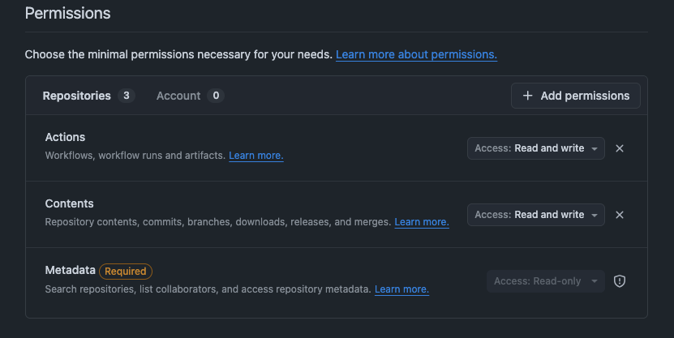
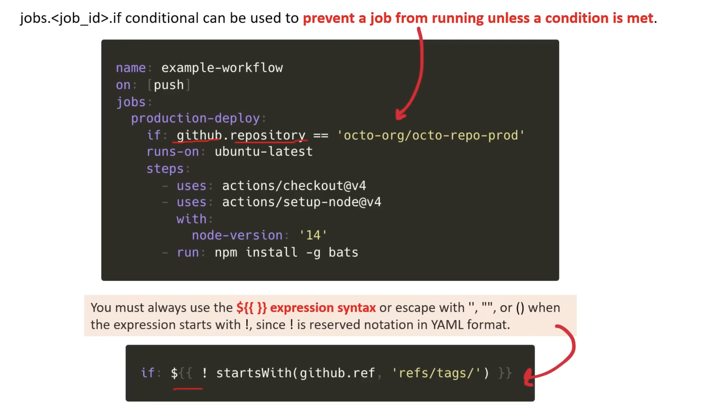

# GitHub Actions Demo Repo

This repo is used to explore and follow along with:

[GitHub Actions FreeCodeCamp](https://www.youtube.com/watch?v=Tz7FsunBbfQ)

as a means of attaining the GitHub Actions Certification.

## Script library for reference:

### Manual Trigger using endpoint

```sh
gh workflow run workflow-dispatch-manual-trigger.yaml -f name=Travis -f greeting=Hello -F data=@mydata
echo '{"name":"Travis", "greeting":"Hello"}' | gh workflow run workflow-dispatch-manual-trigger.yaml --json
```

## Repository Dispatch and Webhook event types: `repository_dispatch` and `types`

### What is `repository_dispatch`?

`repository_dispatch` is a GitHub Actions event trigger that allows an **external service** to trigger a workflow by sending a POST request to the GitHub API.

The external service hits this endpoint:

```
POST /repos/{owner}/{repo}/dispatches
```

With a JSON body that includes an `event_type`:

```json
{
  "event_type": "pizza"
}
```

---

### What are `types`?

`types` is a filter under `repository_dispatch`. It's a list of **custom strings you define yourself** — they have no special meaning to GitHub. The workflow will only trigger if the `event_type` in the incoming POST request **exactly matches** one of the strings listed under `types`.

---

### Example

If we have this workflow:

```yaml
name: "Food Order Workflow"

on:
  repository_dispatch:
    types:
      - pizza
```

#### ✅ This WILL trigger the workflow:

```json
{
  "event_type": "pizza"
}
```

The `event_type` matches `pizza` — workflow fires.

#### ❌ This will NOT trigger the workflow:

```json
{
  "event_type": "chicken-wings"
}
```

The `event_type` doesn't match any listed type — workflow is ignored.

---

### Handling multiple types

You can list multiple types if you want the workflow to respond to more than one event:

```yaml
on:
  repository_dispatch:
    types:
      - pizza
      - chicken-wings
      - burger
```

Now all three `event_type` values will trigger the workflow. Anything else (e.g. `"tacos"`) will still be ignored.

---

### Full example

```yaml
name: "Food Order Workflow"

on:
  repository_dispatch:
    types:
      - pizza
      - chicken-wings

jobs:
  handle-order:
    runs-on: ubuntu-latest
    steps:
      - name: Print the order type
        run: echo "Received order: ${{ github.event.action }}"
```

> **Note:** `github.event.action` holds the `event_type` value from the POST request body — so you can use it inside your workflow steps to know which event fired.

### Webhook Event Script


```sh
curl -X POST \
-H "Accept: application/vnd.github+json" \
-H "Authorization: token {PAT} \
-d '{"event_type": "webhook", "client_payload": {"key": "value"} }' \
https://api.github.com/repos/{owner}/{repo}/dispatches
```

### Token permissions for using `repository_dispatch`

When triggering a `workflow_dispatch` or `repository_dispatch`, we're essentially telling GitHub to **create a new workflow run** on the repository.

So, add these permissions to a PAT token:

>- Actions: **Read** and **Write**
>- Contents: **Read** and **Write**



## Conditionals

We can use:

```yaml
jobs:
  build:
    if: github.repository == 'travboz/exampro-github-actions-examples'
    runs-on: ubuntu-latest
    steps:
      - name: True - so say hello
        run: |
          echo "Hello ${{ github.actor }}"
```

the conditional `if: github.repository == 'travboz/exampro-github-actions-examples'` to run a job if/if-not a statement is true or false.

Just be aware that to `negate` or reverse a conditional, we do:

`if: ${{ !(github.repository == 'travboz/exampro-github-actions-examples') }}`

We can also use `!=` as well. See [expressions](https://docs.github.com/en/actions/reference/workflows-and-actions/expressions) in the docs.



## Expressions for reference:

| Function | Signature | Example |
|----------|-----------|---------|
| `contains` | `contains(search, item)` | `contains('Hello world', 'llo')` |
| `startsWith` | `startsWith(searchString, searchValue)` | `startsWith('Hello world', 'He')` |
| `endsWith` | `endsWith(searchString, searchValue)` | `endsWith('Hello world', 'ld')` |
| `format` | `format(string, replaceValue0, replaceValue1, ..., replaceValueN)` | `format('Hello {0} {1} {2}', 'Mona', 'the', 'Octocat')` |
| `join` | `join(array, optionalSeparator)` | `join(github.event.issue.labels.*.name, ', ')` |
| `toJSON` | `toJSON(value)` | `toJSON(job)` |
| `fromJSON` | `fromJSON(value)` | — |
| `hashFiles` | `hashFiles(path)` | `hashFiles('**/package-lock.json', '**/Gemfile.lock')` |

| Status Check Function | Description |
|-----------------------|-------------|
| `success()` | Returns `true` when none of the previous steps have failed or been cancelled |
| `always()` | Always returns `true`, even if cancelled |
| `cancelled()` | Returns `true` if the workflow was cancelled |
| `failure()` | Returns `true` when any previous step of a job fails |

### Single trigger vs. Multiple trigger events

If we there are **multiple event triggers** in a workflow then, if any of those events are triggered, a workflow run starts for that trigger.

<blockquote>So, we could have <strong>multiple workflows</strong> running at once.</blockquote>

#### If we have a `single` trigger: example

```yaml
name: CI on Single **Event**

on:
    push:
        branches: [ main ]

jobs:
    build:
        runs-on: ubuntu-latest
        steps:
            - name: Checkout repository code
              uses: actions/checkout@v6
            
            - name: Run echo to say hello
              run: echo "Hello, ${{ github.actor }}"
```

We have only **one** trigger: a **push** to the **main** branch of the repo.

#### If we have `multiple` triggers: example

```yaml
name: CI on Multiple Events

on:
    push:
        branches:
            - main
    pull_request:
        branches:
            - main
    release:
        types:
            - published
            - created

jobs:
    build-and-test:
        runs-on: ubuntu-latest
        steps:
            - name: Checkout repository code
              uses: actions/checkout@v6
```

We have **three** triggers:

1. a **push** to **main**
2. a **pull request** into **main**
3. a **release** of the code with types **published** and **created**

If **ANY** of these triggers were to occur simultaneously then:

- **MULTIPLE** workflow runs would occur.
