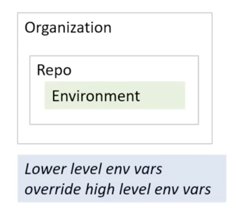

# Configuration Variables

**Configuration Variables** are variables that allow you to pass **non-sensitive** information into a GitHub Actions workflow.

They are accessed via the `vars` context:

```yaml
${{ vars.APP_ID_EXAMPLE }}
```

## Variable Scopes

The same three-level hierarchy as secrets applies. Lower-level variables override higher-level ones.

- **Organization** — shared across multiple repos; access controlled by policy. Updating an org variable propagates to all shared repos.
- **Repository** — available across all environments within a single repo.
- **Environment** — scoped to a specific environment; supports required reviewers as an access gate.



## Naming Rules

Same rules as secrets:

- Alphanumeric characters and underscores only — no spaces (e.g. `Hello_world123`)
- Cannot start with `GITHUB_`
- Cannot start with a number
- Case-insensitive
- Must be unique at the level they're created at

## Example of using `vars` context to access the configuration variables

```yaml
on:
  workflow_dispatch:

env:
  # Setting an environment variable with the value of a configuration variable
  env_var: ${{ vars.ENV_CONTEXT_VAR }}

jobs:
  display-variables:
    name: ${{ vars.JOB_NAME }}
    # You can use configuration variables with the `vars` context for dynamic jobs
    if: ${{ vars.USE_VARIABLES == 'true' }}
    runs-on: ${{ vars.RUNNER }}
    environment: ${{ vars.ENVIRONMENT_STAGE }}
    steps:
    - name: Use variables
      run: |
        echo "repository variable : $REPOSITORY_VAR"
        echo "organization variable : $ORGANIZATION_VAR"
        echo "overridden variable : $OVERRIDE_VAR"
        echo "variable from shell environment : $env_var"
      env:
        REPOSITORY_VAR: ${{ vars.REPOSITORY_VAR }}
        ORGANIZATION_VAR: ${{ vars.ORGANIZATION_VAR }}
        OVERRIDE_VAR: ${{ vars.OVERRIDE_VAR }}
        
    - name: ${{ vars.HELLO_WORLD_STEP }}
      if: ${{ vars.HELLO_WORLD_ENABLED == 'true' }}
      uses: actions/hello-world-javascript-action@main
      with:
        who-to-greet: ${{ vars.GREET_NAME }}
```

## Setting Configuration Variables via the CLI

```bash
# set a variable for the current repo (interactive prompt)
gh variable set MYVARIABLE

# set a variable from an environment variable
gh variable set MYVARIABLE --body "$ENV_VALUE"

# set a variable from a file
gh variable set MYVARIABLE < myfile.txt

# set a variable for a specific deployment environment
gh variable set MYVARIABLE --env myenvironment

# set an org-level variable visible to all repos
gh variable set MYVARIABLE --org myOrg --visibility all

# set an org-level variable visible to specific repos
gh variable set MYVARIABLE --org myOrg --repos repo1,repo2,repo3

# set multiple variables imported from a .env file
gh variable set -f .env
```

Docs: [defining config variables for workflows](https://docs.github.com/en/actions/how-tos/write-workflows/choose-what-workflows-do/use-variables#defining-configuration-variables-for-multiple-workflows)