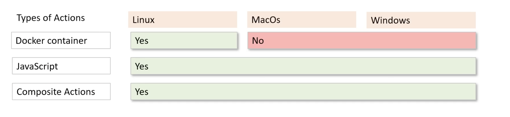
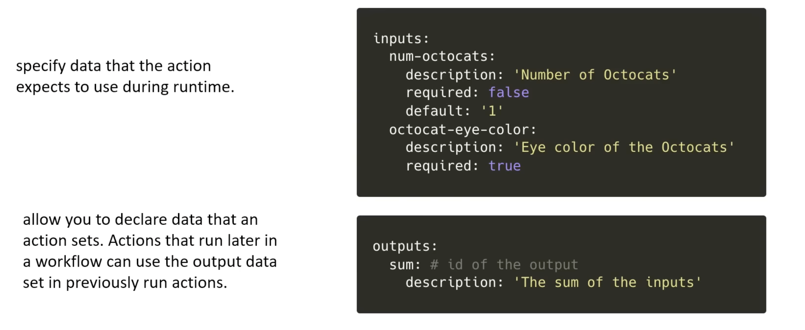

# Creating your own Custom Action

## Action Types

Actions can run `directly on a machine` or `in a Docker container`.

And so, here are the types:

1. Docker containers
2. JavaScript
3. Composite Actions

| Action type | Where can it run? |
| -- | -- |
| Docker container action | Docker container actions can only execute on runners with a `Linux` operating system. |
| JavaScript action | JavaScript actions can run directly on a runner machine with any host OS (Ubuntu, Windows, macOS). |
| Composite actions | Any OS. |



### 1. Docker Containers

These package everything into a nice little container.

Docker containers allow to do the following:

- use specific versions of an OS
- use specific dependencies versions
- use specific tool versions
- use specific code

For actions that must run in a specific environment configuration, Docker is an ideal option because you can customize the operating system and tools.

We're in control of the container environment!

### 2. JavaScript actions

These keep the action's `code` and the `environment` used to run the code - separated.

- simplifies the actual code used to create the action
- executes faster than a Docker action (because we need to spool up a container)

To ensure a JavaScript action can run on `any runner`, and to make sure it doesn't break, you need to follow two simple rules:

- Stick to standard JavaScript: Don't write code that depends on external software, tools, or applications (binaries) that someone has to install (can use `npm` packages, just not stuff that requires installation like homebrew or cmd.exe).

- Use what's already there: Your code runs directly on GitHub's computers. It can only use the basic software and tools that GitHub has already pre-installed on those machines.

### 3. Composite actions

A composite action is a **`reusable chunk of steps`** you package up and give a name to. Instead of copy-pasting the same five steps across every workflow, you define them once in an `action.yml` file and call them from anywhere with a single `uses:` line.

#### Example

Say every workflow needs to set up Go, restore the cache, and install dependencies. Without a composite action, you repeat those steps everywhere. With one, you write them once:

```yaml
# .github/actions/setup-go-env/action.yml
name: Setup Go Environment
runs:
  using: composite
  steps:
    - uses: actions/setup-go@v5
      with:
        go-version: '1.22'

    - name: Restore cache
      uses: actions/cache@v4
      with:
        path: ~/go/pkg/mod
        key: ${{ runner.os }}-go-${{ hashFiles('**/go.sum') }}

    - name: Install dependencies
      run: go mod download
      shell: bash
```

Then in any workflow, you just do:

```yaml
- name: Setup Go environment
  uses: ./.github/actions/setup-go-env
```

Three steps become one line. Change the Go version in one place and every workflow picks it up automatically.

---

The key distinction worth knowing: unlike a regular (JavaScript or Docker) action, a composite action is just a sequence of steps — `run` commands, `uses` references, whatever you'd normally write inline — promoted into a `named, reusable unit`.

## Metadata file: `action.yml`

Special file for defining:

- inputs
- outputs

for the action.

Examples of inputs and outputs:

- inputs: working directory, version, api key
- outputs: artifact, sum of numbers



## The `using` attribute

`using` will determine what action type the custom action has (javascript, container, or composite).
`using` will therefore determine how the action is executed.

The `using` attribute in a custom action's `action.yml` tells GitHub Actions **how to run** your action.

---

### 1. `using: 'node20'` — JavaScript Action

```yaml
# action.yml
name: My JS Action
description: Does something with Node
runs:
  using: 'node20'
  main: 'dist/index.js'
  post: 'dist/cleanup.js'  # optional: runs after job
```

Runs a JavaScript file with Node.js 20. Most common for actions on the Marketplace.

---

### 2. `using: 'docker'` — Docker Container Action

```yaml
# action.yml
name: My Docker Action
description: Runs in a container
runs:
  using: 'docker'
  image: 'Dockerfile'        # or a public image: 'docker://alpine:3.18'
  entrypoint: '/entrypoint.sh'
  args:
    - ${{ inputs.my-input }}
```

Builds and runs a Docker container. Slower to start but fully isolated — any language, any dependency.

---

### 3. `using: 'composite'` — Composite Action

```yaml
# action.yml
name: My Composite Action
description: Combines multiple steps
runs:
  using: 'composite'
  steps:
    - name: Install deps
      run: npm ci
      shell: bash

    - name: Run tests
      run: npm test
      shell: bash

    - name: Call another action
      uses: actions/setup-node@v4
      with:
        node-version: '20'
```

Bundles multiple `run` steps and `uses` references into a reusable unit. No build step needed — great for shell-based workflows.

---

## Quick Comparison

| `using` value     | Language          | Startup | Best for                      |
|-------------------|-------------------|---------|-------------------------------|
| `node20` / `node16` | JavaScript/TypeScript | Fast    | Most custom actions           |
| `docker`          | Anything          | Slower  | Complex deps, non-JS tools    |
| `composite`       | Shell / any       | Fast    | Wrapping existing steps       |

> The `composite` type is the most practical for repo-internal actions — plain shell, no build step required.

## Best practice resource for releasing actions

See [this docs page](https://docs.github.com/en/actions/how-tos/create-and-publish-actions/manage-custom-actions) which outlines best practices that should be followed when releasing a custom action.
