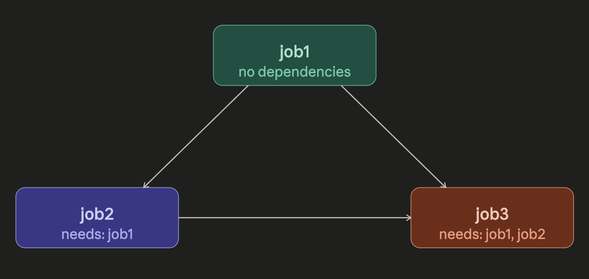

# Dependent jobs

We can create a Directed-Acyclic-Graph of jobs by using dependencies and the `needs` keyword.

Like so:

```yaml
jobs:
    job1:
    job2:
        needs: job1
    job3:
        needs: 
            - job1
            - job2
```

We have `job1` which doesn't depend on anything and can run by itself.
We have `job2` which **waits** for `job1` to finish because it ***depends*** on some imaginary output from `job1`.
`job3` depends on BOTH `job1` and `job2`.



The key thing to notice:

`job3` has two incoming edges — it can't start until both `job1` and `job2` complete.
Since `job2` itself depends on `job1`, the effective execution order is strictly sequential: `job1` → `job2` → `job3`. There's no parallelism in this particular config.
If `job3` only needed `job1` (dropping the `job2` dependency), then `job2` and `job3` could run in parallel after job1 finishes.
