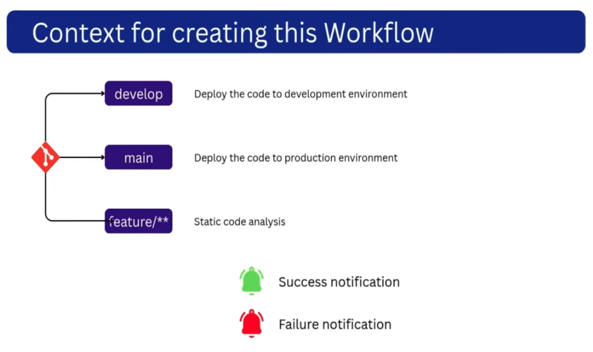

# Explanation of example workflow with multiple branches and multiple tasks

This project has multiple branches, and a workflow/job assigned to each branch.

| Branch | Action taken/triggered |
| -- | -- |
| `develop` | When code is pushed to `develop` we run an action to deploy the code to the **development** environment |
| `main` | Deploy the code to the **production** environment |
| `feature/**` | Static code analysis |

If any of these fail, we send a **failure** notification.
On success, we send a **success** notification.

