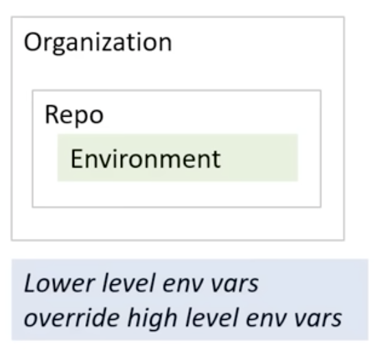

# Using Secrets

## Encrypted Secrets

**Encrypted Secrets** are variables that allow sensitive information to be passed into a GitHub Actions workflow.

Secrets are accessed via the `secrets` context:

```yaml
${{ secrets.MY_SECRET }}
```

## Secret Scopes

Secrets can be defined at three levels. Lower-level secrets override higher-level ones.



- **Organization** — shared across multiple repos; access can be restricted by policy. Updating an org secret propagates to all repos using it.
- **Repository** — available across all environments within a single repo.
- **Environment** — scoped to a specific environment; supports required reviewers as an access gate.

## Naming Rules

- Alphanumeric characters and underscores only — no spaces (e.g. `Hello_world123`)
- Cannot start with `GITHUB_` prefix
- Cannot start with a number
- Case-insensitive
- Must be unique at the level they're created at

## Passing Secrets

There are two ways to pass a secret into a step.

### As an input

Pass directly to an action via `with`:

```yaml
- name: Custom action using secret
  uses: example/action@v1
  with:
    api-key: ${{ secrets.API_KEY }}
```

### As an environment variable

Map the secret to an env var, then reference it in your script with the standard `$VAR_NAME` syntax:

```yaml
- name: Run a script using secret
  run: |
    echo "Using API key: $API_KEY"
  env:
    API_KEY: ${{ secrets.API_KEY }}
```

The `env` block is what makes the secret available to the shell — without it, `$API_KEY` would be empty.

## Setting Secrets via the CLI

### Repository-level

```bash
# set a secret and prompt for secret value
gh secret set SECRET_NAME

# set a secret with value from a file
gh secret set SECRET_NAME < secret.txt
```

### Environment-level

```bash
# set a secret and prompt for secret value
gh secret set --env ENV_NAME SECRET_NAME

# list secrets for an environment
gh secret list --env ENV_NAME
```

### Organization-level

```bash
# login with admin:org scope to manage org secrets
gh auth login --scopes "admin:org"

# set a secret for private repos only (prompts for value)
gh secret set --org ORG_NAME SECRET_NAME

# set a secret for public, private, and internal repos
gh secret set --org ORG_NAME SECRET_NAME --visibility all

# set a secret for specific repos only
gh secret set --org ORG_NAME SECRET_NAME --repos REPO-NAME-1, REPO-NAME-2

# list secrets for the org
gh secret list --org ORG_NAME
```