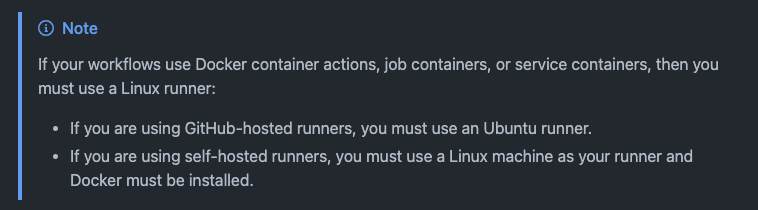
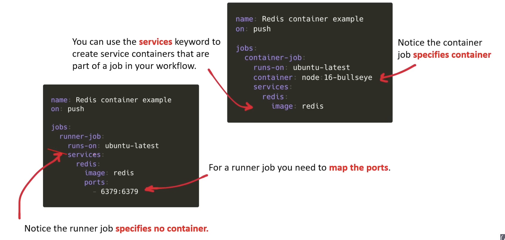

# 🐳 Docker Containers in GitHub Actions → a.k.a *Serivce Containers*

Service containers are **Docker containers** that provide a way to spin up services to **test** or **operate** your application in a workflow.

Service containers are extra Docker containers that run alongside a job in a GitHub Actions workflow.

They’re useful for things like `databases`, `caches`, and `web services` during *testing*.

Common examples from the docs:

- `redis` for cache/data tests
- `postgres` for database tests
- `mysql` for database tests
- `nginx` or other web services

- We can configure service containers for **each job** in a workflow
- GitHub **creates a fresh Docker container** for each service we've configured in the workflow, and then destroys the containers when the job completes
- Steps in a job can communicate with all the service containers that are part of that same job
- We **`CANNOT`** create and use service containers inside **composite actions**
- The runner automatically creates a Docker network and manages the life cycle of the service containers.

## The Golden Rule

> **Docker anything = Linux runner. No exceptions.**

"Docker anything" means: container actions, job containers, or service containers.

So, if we're going to use `Service Containers` then we **MUST** have the `runs-on` set to:



---

## Memory Hook

Think of it as **"Docker lives in Linux"** — Docker was born on Linux, and GitHub Actions keeps it that way.

```bash
Docker action / job container / service container
        ↓
    Linux only
        ↓
  GitHub-hosted? → ubuntu-latest
  Self-hosted?   → Linux machine + Docker installed
```

---

## Common Gotcha

Using `windows-latest` or `macos-latest` with a container? It **will fail**.  
Always double-check your `runs-on:` when containers are involved.

## Example workflow

```yaml
name: Service container example
on: workflow_dispatch

jobs:
  test:
    runs-on: ubuntu-latest

    services:
      postgres:
        image: postgres
        env:
          POSTGRES_PASSWORD: postgres
        ports:
          - 5432:5432 # NOTICE: we set a port mapping here so we can connect to it through local host
        options: >-
          --health-cmd pg_isready
          --health-interval 10s
          --health-timeout 5s
          --health-retries 5

    steps:
      - uses: actions/checkout@v6

      - name: Test connection
        run: |
          echo "Connect to PostgreSQL on localhost:5432"
```

If the job itself *runs in a container*, you usually do not need to map ports; you can use the service label as the hostname, for example `postgres` or `redis`.

## Clarifying `job runs in a container`

### When the job itself runs in a container

This means you set `jobs.<job_id>.container`, so the job steps run inside a Docker container too.

What that changes:

- The job container and service containers are on the **same** Docker network.
- You can reach the service by its label name, like `redis` or `postgres`.
- You usually do not need to map ports.
- The hostname is the service label.

Example:

service label: `redis`
connect to it from the job as `redis:6379`

### When the job runs directly on the runner machine

If you do not set `jobs.<job_id>.container`, the job runs on the runner itself.

What that changes:

- You must map service ports to the host with ports
- Then access the service with `localhost:<port>` or `127.0.0.1:<port>`

Example:

- service port mapping: `5432:5432`
- connect to it as `localhost:5432`

## Credentials in Service Containers

We can specify **credentials** for service containers in case we need authentication with an image registry.

```yaml
jobs:
    build:
        services:
            redis:
                # Docker hub image
                image: redis
                ports:
                    - 6379:6379
                credentials:
                    username: ${{ secrets.dockerhub_username }}
                    password: ${{ secrets.dockerhub_password }}

            db:
                # Private registry image
                image: ghcr.io/octocat/testdb:latest
                credentials:
                    username: ${{ github.repository_owner }}
                    password: ${{ secrets.ghcr_password }}


## Summary

Easy way to tell the difference:



notice how we do not have `job.<job_id>.container` set in the left image and so it's running on the runner machine.

- **Job in a container** = your workflow steps run inside Docker, and the service is reached by name.
- **Job on the runner** = your workflow steps run on the machine itself, and the service is reached through localhost with mapped ports.
